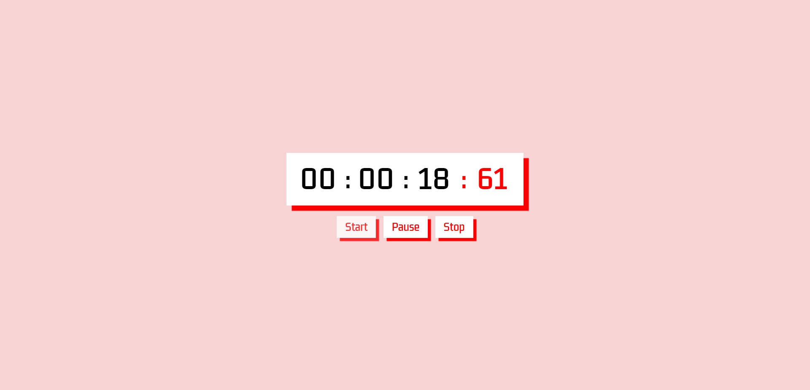

⚠️ AINDA EM AJUSTES ⚠️ 

 

 
 

<h1 align="Star">
Cronômetro Online
</h1>

### Desktop

Cronômetro Online <a href="https://luiabdiel.github.io/stopwatch/" target="_blank">clique aqui </a>para visualiza-lo

 

## Resources

 

    

 

## Start Dev Environment for VSCode

1. Open project folder in `VSCode`
2. Install `Live Server` extension
3. Right click `index.html` > `Open with Live Server`
4. Access the **generated address** in your browser 🚀

<!-- https://dev.to/envoy_/150-badges-for-github-pnk -->
